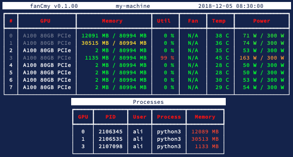

# FancySMI

Just a stylized `nvidia-smi`.

```shell
pip install fancy-smi
```

## Overview
```shell
fancy-smi
```



## Watch
Use the `-r` arg to set a refresh rate:
```shell
fancy-smi -r 1
```

## Requirements
* Python 3.6 and above
* `rich` package:
 
```shell
pip3 install rich
```

